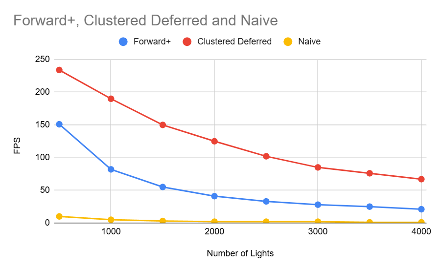
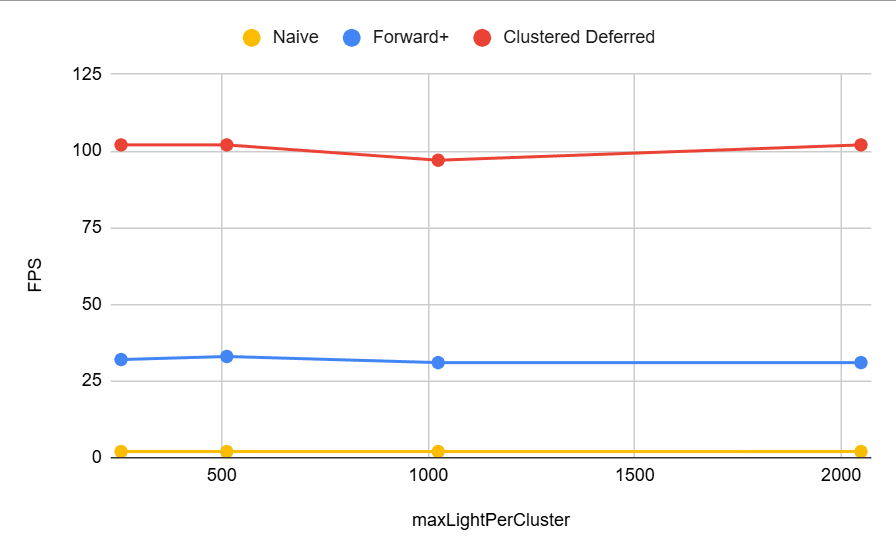

WebGL Forward+ and Clustered Deferred Shading
======================

**University of Pennsylvania, CIS 565: GPU Programming and Architecture, Project 4**

* Yuntian Ke
* Tested on: Windows 11, Intel Core Ultra 9 275HX @ 2.70GHz 32GB, RTX 5070 Ti 30160MB

### Live Demo

### Demo Video/GIF

### Project Overview
This project implements Naive, Forward+ and Clustered Deferred Shading in WebGPU for real-time rendering of the Sponza Atrium scene illuminated by hundreds to thousands of dynamic point lights. The goal is to efficiently manage and compute lighting in dense scenes using GPU compute passes and clustered light assignment.

### Implemented Feature
- Naive  
Implemented a simple forward renderer with camera view–projection matrix buffering and uniform binding.
- Forward+  
Implemented 3D light clustering in the camera frustum using a compute shader. Constructed per-cluster light lists and used them in the forward shading pass to limit per-fragment lighting calculations. Designed GPU buffers and bind groups for storing cluster AABBs and light indices.
- Clustered Deferred  
Extended the Forward+ clustering logic to a deferred pipeline. Created a G-buffer storing world position, normal, and albedo in multiple render targets. Implemented a fullscreen lighting pass that reads from the G-buffer and applies lighting only from relevant clusters.

### Performance Analysis

The chart above compares Forward+, Clustered Deferred, and Naive Forward Rendering performance as the number of point lights increases from 500 to 4000.

**1. Which is faster?**  

- **Clustered Deferred** is consistently the fastest across all light counts, maintaining above 200 FPS at 500 lights and still around 60 FPS with 4000 lights.    
- **Forward+** performs well for moderate light counts but drops more quickly as the number of lights increases.  
- **Naive** is by far the slowest, dropping below 10 FPS even at a few hundred lights.

The chart above compares the performance among different MaxLightPerCluster, when the number of lights is 2500. Though the performance did not show much difference when increasing from 256 to 2048, the rendered reusult can be different. Under my setting, when `MaxLightPerCluster = 256`, I observed many small visible square artifacts in the scene.

**2. Which is better for a certain type of workloads?**
- Forward+ is better suited for scenes with moderate light counts and complex materials since it shades directly in the forward pass, avoiding G-buffer memory overhead.
- Clustered Deferred excels for large, light-dense scenes, as it decouples geometry and lighting passes, allowing efficient reuse of G-buffer data and avoiding redundant shading.

**3. Tradeoffs**
- **Naive**  
It has simple pipeline, minimal setup. But it also has extremely poor scalability, due to that each fragment computes all lights.
- **Forward+**  
Efficient culling of lights per cluster and works well for transparency. But it gets slightly more GPU overhead due to clustering compute pass and performance drops with many lights.
- **Clustered Deferred**  
Excellent scalability and very high performance with thousands of lights. But it gets higher memory bandwidth from G-buffer usage and harder to handle transparency.

**4. Performance Differences**
- Naive Forward scales linearly with light count, causing massive overdraw and redundant lighting calculations per pixel.

- Forward+ reduces redundant work by limiting light evaluation to those intersecting each cluster, but each fragment still runs the shading logic.

- Clustered Deferred avoids re-executing geometry shading and stores intermediate data in G-buffers, enabling the lighting pass to be efficiently parallelized over screen pixels only.

### Credits

- [Vite](https://vitejs.dev/)
- [loaders.gl](https://loaders.gl/)
- [dat.GUI](https://github.com/dataarts/dat.gui)
- [stats.js](https://github.com/mrdoob/stats.js)
- [wgpu-matrix](https://github.com/greggman/wgpu-matrix)
